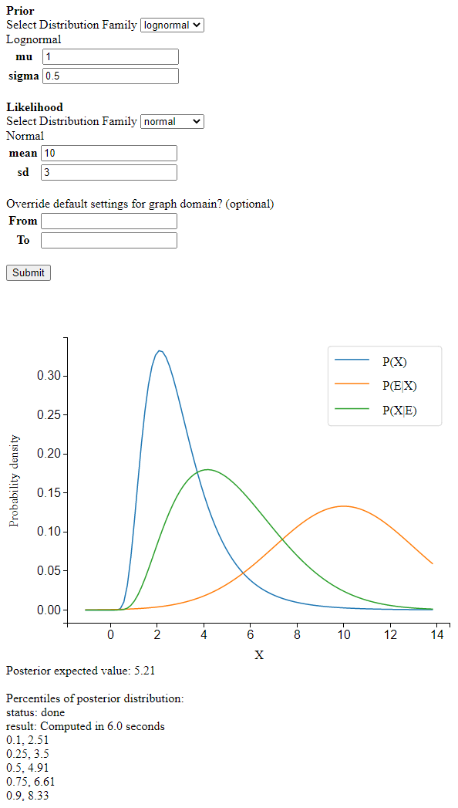

* Do a Bayesian update where the prior PDF and the likelihood function are continuous. Currently supports 1 dimensional distributions. 
* Web application for the library [tadamcz/bayes-continuous](https://github.com/tadamcz/bayes-continuous).
* Deployed at [bayesupdate.com/](https://bayesupdate.com/)

# Screenshot

# Development
* The use of a pip ["editable" install](https://pip.pypa.io/en/stable/cli/pip_install/#editable-installs) for the package `bayes_continuous` might confuse your IDE's index into thinking the files under that package don't exist. In PyCharm, I've found that `File -> Invalidate Caches` fixes the issue.